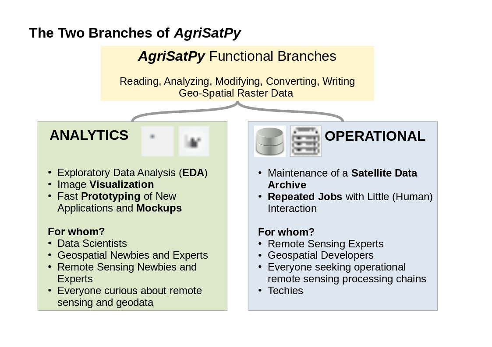

# *AgriSatPy*

**Reading, Analyzing, Modifying, Converting, Writing Geo-Spatial Raster Data**


*AgriSatPy* is a lightweight `Python` package to **explore**, **organize** and **process** geo-spatial **raster** and epecially (satellite) **remote sensing data** in an easy and intuitive manner.

Developed for **agricultural remote sensing applications** with
**Sentinel-2**, this is still the main thematic focus. However, due to its **modular and object-oriented programming structure**, it allows in principle the **processing of any type of raster data** and can
be **adapted** to **other remote sensing platforms** or **raster data sources** (e.g., Digital Elevation Models, Land Cover Maps, etc.).

Check out our minimum-effort [examples](#examples) and read about our [philosophy](#philosophy).

## Main Features

* **reading and writing raster data** from **all raster file formats** understood by [GDAL](https://gdal.org/)
* `object-oriented-programming` handling of raster data objects
* rasterization of vector features from all vector file formats understood by [fiona](https://pypi.org/project/Fiona/) or from [geopandas](https://geopandas.org/en/stable/) `GeoDataFrame` instances
* storage of raster bands with different spatial resolutions (and even extents) in a single raster handler instance allowing to do raster analytics **without the need to resample the data first** (e.g., extraction of pixel values across spectral bands with different spatial resolutions)
* dedicated and convenient **support for Sentinel-2 data** stored in [.SAFE format](https://earth.esa.int/SAFE/) (processing levels: [L1C](https://sentinels.copernicus.eu/web/sentinel/user-guides/sentinel-2-msi/processing-levels/level-1) and [L2A](https://sentinels.copernicus.eu/web/sentinel/user-guides/sentinel-2-msi/processing-levels/level-2))
* implements a **backend** for **operational (Sentinel-2) satellite data storage, querying and processing** using a [PostGIS](https://postgis.net/) `spatial database`.

## Structure
*AgriSatPy* consists of **two main branches**: **ANALYTICS** and **OPERATIONAL**



## Examples

The following examples show you how to **get started** with as little effort as possible:

### Sentinel-2 Image


### Digital Terrain Model Data

We will read a cloud-optimized geoTiff from [SwissTopo](https://www.swisstopo.admin.ch/), load and visualize it. The data is a tile from the high-resolution Digital Elevation Model of Switerland [SwissALTI3D](https://www.swisstopo.admin.ch/en/geodata/height/alti3d.html) and shows a mountain ridge close to Zermatt:

```python
from agrisatpy.io import SatDataHandler

# link to cloud-optimized geoTiff resource at Swisstopp
dem_file = 'https://data.geo.admin.ch/ch.swisstopo.swissalti3d/swissalti3d_2019_2618-1092/swissalti3d_2019_2618-1092_2_2056_5728.tif'

# get SatDataHandler instance
handler = SatDataHandler()
# read the data into the current SatDataHandler instance
handler.read_from_bandstack(
    fname_bandstack=dem_file
)

# we can overwrite the default band names (usually B1, B2, ..) to, e.g., "Elevation"
handler.reset_bandnames(['Elevation'])

# we can check the physical unit of the "Elevation" band data
band_unit = handler.get_attrs('Elevation')['units'][0]

# visualize the "Elevation" band
fig = handler.plot_band(
    band_name='Elevation',
    colormap='terrain',
    colorbar_label=f'Elevation above Mean Sea Level [{band_unit}]'
)
# optionally save the figure to disk
fig.savefig('../img/AgriSatPy_SwissALTI3D_sample.png', dpi=150, bbox_inches='tight')

```

The output:


## The philosophy:

We believe that researchers and analysts should **deal as little as possible with file handling and backend engineering**. In addition, the underlying source code should be **open source** and non-proprietary.
However, in the field of optical remote sensing it is still difficult to analyse satellite data without being confronted with these tasks or resorting to proprietary solutions.
Therefore, we have developed AgriSatPy in such a way that a large part of these tasks is taken away from the user and provided in the form of self-explanatory attributes and methods on a high semantic level.

AgriSatPy can be used for **rapid prototyping**. At the same time, AgriSatPy also offers support for the **operational use of satellite data** - for example by maintaining a metadatabase and providing API-level
 functions. In contrast to related projects such as the [OpenDataCube](https://www.opendatacube.org/) Initiative, AgriSatPy can be used without the need for complex installations - many of the basic functions
 for interacting with raster data follow the " **plug-and-play** " principle.

AgriSatPy can be used by users with little coding experience as well as by experienced developers. This is made possible by the object-oriented and modular structuring of the code, as well as the detailed
documentation.

AgriSatPy provides **interfaces** to widely used Python libraries such as [xarray](https://xarray.pydata.org/en/stable/#) and [geopandas](https://geopandas.org/en/stable/) and uses [rasterio](https://rasterio.readthedocs.io/en/latest/) and [numpy](https://numpy.org/) as backend.

## Why AgriSatPy

coming soon

## Capabilities

coming soon

## Code Documentation

We use [sphinx](https://www.sphinx-doc.org/en/master/) and the [autodoc-extension](https://www.sphinx-doc.org/en/master/usage/extensions/autodoc.html) to generate a Read-The-Docs like documentation of our modules, classes and functions.

With ```sphinx-apidoc -o ./source ../src``` run in the ```./docs``` directory you can generate the required .rst files if not yet available.

## Contributing
Yes please :)

Before you start, please:
- familiarize yourself working with `git` if you haven't used it before. Always work in **your own fork** and **never in the master branch**.
- use meaningfull commit messages and try to commit your changes with a certain granularity (e.g, module-wise).
- All changes must be submitted using `merge requests`. The merge request should also have a small message text where you explain what this merge will change.
- make sure to follow the [coding style conventions](./CODE_STYLE.md).
- provide test (pytest) cases whenever possible.

## Versioning Rules

We use [setuptools-scm](https://pypi.org/project/setuptools-scm/) with a post-release scheme for dynamic versioning based on git commit IDs and git tags.

A **release** is a stable version of the package and should be used for operational purposes. Each release should have a version. The versioning system used is `vMajor.Minor (e.g., v1.1)`.
In addition to releases we have `development versions`. This also receive version numbers based on a `post-release` versioning logic. This consists of the latest stable version (i.e., the base for the development), plus the number of the commit since the last release. An example for such a development version is:

```bash
v1.1.post44+gaaa8b16
```

In this example, `v1.1` indicates that v1.1 was the last stable release on which the current development version is based. `post` means that the current version was created *after* this release. `44` is the number of commits since the last release and `gaaa8b16` a shortened version of commit UID.

To create a new release, commit and push all your changes into your development branch and merge them into the main project's master.

Next, checkout the master branch and pull the merged changes locally. Then add a git tag (by increasing the version number):

```bash
git checkout master
git pull upstream master
git tag -a v<major>.<minor> -m "v<major>.<minor>"
git push upstream master
```
Then publish the package to the PyPI package index by running `publish_pypi.sh` or `publish_pypi.bat` depending on your OS.

**NOTE**: git tags won't be fetched by simply pulling from the upstream's master branch. They must be fetched using

```bash
git fetch upstream
```

You can verify that you have received the tag by typing `git tag -l` to get a list of all available git tags.

Then checkout your development branch again.

**IMPORTANT**:

- New releases should always be discussed with the other developers.
- Only the package administrator should be able to publish new releases.
- Always add the most important changes to changelog so that it will be possible to track the development between the releases

