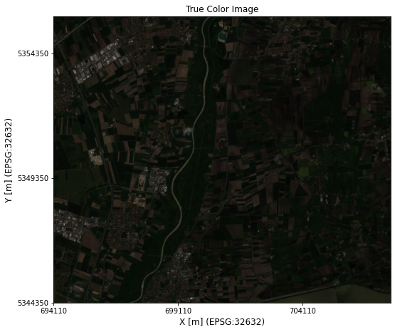
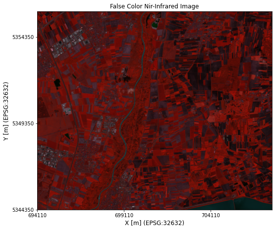
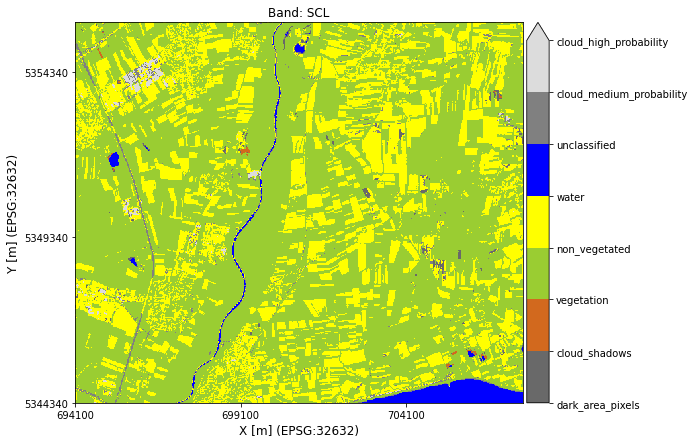
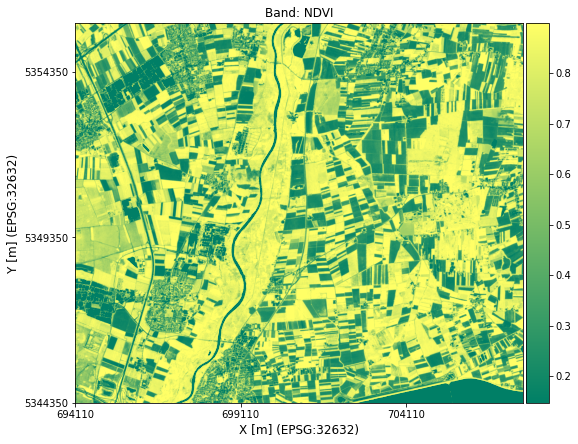
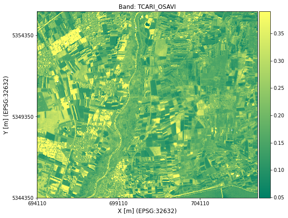
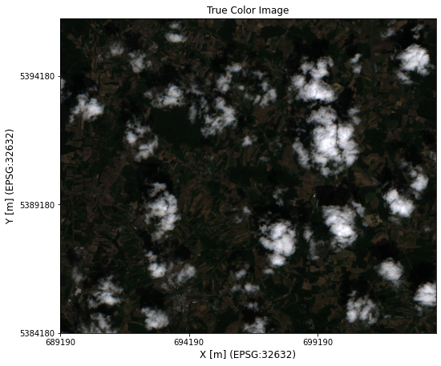
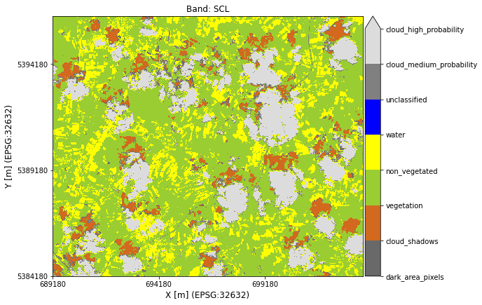
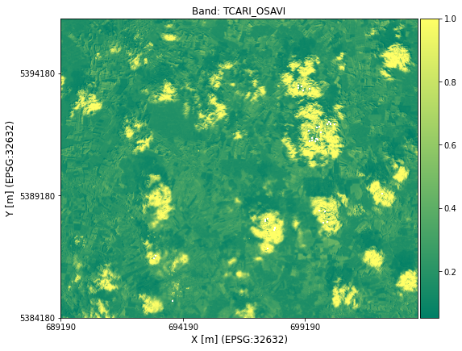
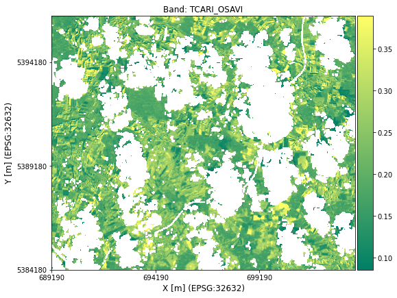

.. _example_sentinel-2_data_handling:

Sentinel-2 Data Handling with **AgriSatPy**
===========================================

Learning Objectives
-------------------

In this notebook you will learn how to

-  load data from a Sentinel-2 scene organized in the .SAFE folder
   structure
-  calculate some basic vegetation indices (e.g., NDVI) for a region of
   interest
-  get cloudy pixel percentage in a selected area of interest (instead
   of relying on scene-wide cloud coverage for filtering datasets)
-  mask clouds and shadows in AOI
-  plot derived vegetation indices
-  visualize the scene classification layer (SCL)
-  save the results to a new geoTiff file

Tutorial Content
----------------

This tutorial is introductorial level. You should know, however, about
the concept of vegetation indices (VIs). If you do not feel confident
about VIs yet, have a look at this `free tutorial by
EO4GEO <http://www.eo4geo.eu/training/sentinel-2-data-and-vegetation-indices/>`__.

To run this notebook no additional requirements in terms of
software-setup are necessary.

The data required to run this notebook can be found
`here <./../data>`__.

.. code:: python3

    # load required modules
    import cv2
    import numpy as np
    
    from pathlib import Path
    from agrisatpy.io.sentinel2 import Sentinel2Handler
    from agrisatpy.analysis.spectral_indices import SpectralIndices
    
    # make plots larger by default
    import matplotlib.pyplot as plt
    plt.rcParams['figure.figsize'] = [10, 10]

I) Load Data from .SAFE Sentinel-2 dataset in Level-2 Processing Level
~~~~~~~~~~~~~~~~~~~~~~~~~~~~~~~~~~~~~~~~~~~~~~~~~~~~~~~~~~~~~~~~~~~~~~

``AgriSatPy`` provides the option to load image data directly from the
`.SAFE <https://earth.esa.int/SAFE/>`__ (Standard Archive Format for
Europe) and do some basic operations without having to convert the data.
This is useful for exploring image data (e.g., quick visualization of
datasets) or **fast** calculation of vegetation indices.

We will conduct the following steps:

-  Download a sample S2-scene in Level-2, i.e., atmospherically
   corrected data (no authentication required)
-  Dislay the RGB, False-Color Infrared and Scene Classification Layer
   for a selected Area of Interest (AOI)
-  Calculate the Normalized Difference Vegetation Index (NDVI) for the
   AOI using the 10m Sentinel-2 bands
-  Calculate the TCARI/OSAVI index for the AOI (requires spatial
   resampling of the 20m bands to 10m)

I.1) Download the Data (Not Authentication/Registration required
^^^^^^^^^^^^^^^^^^^^^^^^^^^^^^^^^^^^^^^^^^^^^^^^^^^^^^^^^^^^^^^^

We created a Mendeley dataset with a sample S2 scene in Level-2 in SAFE
dataset structure. The following lines of code will place the dataset in
the ``../data`` directory and unzip it.

**This might take a while depending on your internet connection!**

.. code:: python3

    # download test data (if not done yet)
    import requests
    from agrisatpy.downloader.sentinel2.utils import unzip_datasets
    
    # URL to the public dataset
    url = 'https://data.mendeley.com/public-files/datasets/ckcxh6jskz/files/e97b9543-b8d8-436e-b967-7e64fe7be62c/file_downloaded'
    
    testdata_dir = Path('../data')
    testdata_fname = testdata_dir.joinpath('S2A_MSIL2A_20190524T101031_N0212_R022_T32UPU_20190524T130304.zip')
    testdata_fname_unzipped = Path(testdata_fname.as_posix().replace('.zip', '.SAFE'))
    
    # check first if the dataset has been already downloaded; only start the download if the dataset is not yet available locally
    if not testdata_fname_unzipped.exists():
    
        # download dataset
        r = requests.get(url, stream=True)
        r.raise_for_status()
        with open(testdata_fname, 'wb') as fd:
            for chunk in r.iter_content(chunk_size=5096):
                fd.write(chunk)
    
        # unzip dataset
        unzip_datasets(download_dir=testdata_dir)

I.2) Read the Data from .SAFE
^^^^^^^^^^^^^^^^^^^^^^^^^^^^^

Once the data is downloaded, we can read a selection of bands using
``agrisatpy.io.sentinel2`` that provides a handler for Sentinel-2 data
in .SAFE format. We will read the following spectral bands

======= ==========
S2 Band Color-Name
======= ==========
B02     blue
B03     green
B04     red
B05     red-edge1
B07     red-edge3
B08     nir1
======= ==========

B02, B03, B04, and B08 have a native spatial resolution of 10m, whereas
B05 and B07 come in 20m spatial resolution.

In addition, we also the read the ``scene classification layer`` (SCL)
that comes as an additional layer in Level-2 (Sen2Cor output). The
spatial resolution of SCL is also 20m. The SCL layer is read
automatically when the processing level is correctly specified as
Level-2A.

.. code:: python3

    # get a new handler object and define bands to read
    handler = Sentinel2Handler()
    # we can either read all bands are define a subset to read
    band_selection = ['B02', 'B03', 'B04', 'B05', 'B07', 'B08']

We will use a AOI covering a subset of the entire S2-scene for which the
data is read:

.. code:: python3

    # define file-path to ESRI shapefile (all formats understood by fiona work)
    in_file_aoi = Path('../data/sample_polygons/BY_AOI_2019_MNI_EPSG32632.shp')
    
    # read data from .SAFE dataset for the selected AOI and spectral bands
    handler.read_from_safe(
        in_dir=testdata_fname_unzipped,
        polygon_features=in_file_aoi,
        band_selection=band_selection
    )

*AgriSatPy* maps the spectral bands of Sentinel-2 automatically to color
names. Through *band aliasing* it is possible to access spectral bands
either through their color name (‘blue’) **or** through their band name
(e.g., ‘B02’).

.. code:: python3

    # get band names, this will return the color names
    handler.bandnames

.. parsed-literal::

    ['blue', 'green', 'red', 'red_edge_1', 'red_edge_3', 'nir_1', 'scl']

.. code:: python3

    # however, the original band names are still available as aliases
    handler.get_bandaliases()

.. parsed-literal::

    {'blue': 'B02',
     'green': 'B03',
     'red': 'B04',
     'red_edge_1': 'B05',
     'red_edge_3': 'B07',
     'nir_1': 'B08',
     'scl': 'SCL'}

Thus, you can use the color or band name to access band data:

.. code:: python3

    (handler.get_band('blue') == handler.get_band('B02')).all()

.. parsed-literal::

    True

NOTE:

::

   The `scene classification layer` (SCL) is loaded automatically when the processing level is Level-2A (L2A). The procesing level is determined automatically by the reader function  based on the naming of the .SAFE dataset.

The handler also automatically extracts some scene-metadata including
the image acquisition time, platform and sensor:

.. code:: python3

    handler.scene_properties.get('acquisition_time')

.. parsed-literal::

    datetime.datetime(2019, 5, 24, 10, 10, 31)

.. code:: python3

    handler.scene_properties.get('platform')

.. parsed-literal::

    'S2A'

.. code:: python3

    handler.scene_properties.get('sensor')

.. parsed-literal::

    'MSI'

.. code:: python3

    handler.scene_properties.get('processing_level')

.. parsed-literal::

    <ProcessingLevels.L2A: 'LEVEL2A'>

Exploring the Data - RGB and False-Color NIR Plots
''''''''''''''''''''''''''''''''''''''''''''''''''

AgriSatPy’s handler class allows for fast visualization of satellite
data using either a custom band selection or some pre-defined band
combinations which are frequently used by the remote sensing community.

First, there is the true color RGB (Sentinel-2 bands B04, B03, B02;
i.e., red, green, blue) plot:

.. code:: python3

    fig_rgb = handler.plot_rgb()

.. parsed-literal::

    Clipping input data to the valid range for imshow with RGB data ([0..1] for floats or [0..255] for integers).

The plot is geo-referenzed, i.e., it shows real (in this case) UTM
coordinates on the x and y axis labels.

Another widely used plotting method is the so-called false-color
infrared using Sentinel-2 bands B08, B04, and B03 (or: nir_1, red,
green):

.. code:: python3

    fig_nir = handler.plot_false_color_infrared()

.. parsed-literal::

    Clipping input data to the valid range for imshow with RGB data ([0..1] for floats or [0..255] for integers).

Exploring the Data - Scene Classification Layer (SCL)
'''''''''''''''''''''''''''''''''''''''''''''''''''''

The SCL layer takes 12 classes and helps to identify clouds, cloud
shadows or vegetated areas. The classes have labels between 0 and 11.
The official legend can be found
`here <https://sentinels.copernicus.eu/web/sentinel/technical-guides/sentinel-2-msi/level-2a/algorithm>`__
(scrawl down).

AgriSatPy’s Sentinel2Handler is able to plot the SCL following the
official color scheme and providing class labels instead of numbers to
make interpretation easier:

.. code:: python3

    fig_scl = handler.plot_scl()

I.3) Calculate the NDVI
^^^^^^^^^^^^^^^^^^^^^^^

For calculating the NDVI, we only need the 10m bands ‘red’ and ‘nir_1’.
*AgriSatPy*\ ’s Spectral Index module is designed in a very generic way
and automatically selectes the required bands based on their color names
(or raises an error if a required band is not found).

.. code:: python3

    # specify the index name (can be lower or upper case)
    vi_name = 'NDVI'
    
    # call the reader's method to calculate indices directly (alternative you can use the SpectralIndices module directly)
    handler.calc_si(si=vi_name)
    
    fig_ndvi = handler.plot_band(band_name=vi_name, colormap='summer')

While we could calculate the NDVI using 10m bands, only, the TCARI/OSAVI
ratio requires resampling of the two red edge bands that come in 20m
spatial resolution. For **spatial resampling** we can use the reader’s
``resample`` method that calles ``opencv2`` in the background.

All we have to do is to specify a target spatial resolution (10m) and
select a resampling method supported by opencv2. In this example, we use
``nearest neighbor`` interpolation. The resample method checks then for
each band if it has to be resampled (based on the band metadata) and
*overwrites* the original entry.

.. code:: python3

    # our targeted spatial resolution is 10m
    target_resolution = 10 # meters
    
    # resample the data but exclude the SCL band since we should not use bicubic interpolation for discrete class values
    handler.resample(
        target_resolution=target_resolution,
        resampling_method=cv2.INTER_NEAREST_EXACT
    )

Then we can proceed with the calculation of the TCARI/OSAVI ratio
(without the resampling of the red edge bands we would get an error
here)

.. code:: python3

    vi_name = 'TCARI_OSAVI'
    
    handler.calc_si(si=vi_name)
    
    fig_tcari_osavi = handler.plot_band(band_name=vi_name, colormap='summer')

More spectral indices (currently mostly vegetation indices) are
available. You can find the list of currently implemented indices using:

.. code:: python3

    vis = SpectralIndices(handler)
    vis.get_si_list()

.. parsed-literal::

    ['AVI',
     'BSI',
     'CI_green',
     'EVI',
     'MCARI',
     'MSAVI',
     'NDRE',
     'NDVI',
     'TCARI_OSAVI']

II) Load Data from .SAFE format and apply Cloud Masking
~~~~~~~~~~~~~~~~~~~~~~~~~~~~~~~~~~~~~~~~~~~~~~~~~~~~~~~

Often it happens that parts of the AOI are covered by clouds and their
shadows. Here, cloud masking comes into play. We show how to use
``AgriSatPy`` and the scene classification layer (SCL) from Sentinel-2
Level-2A data to map clouds in derived image products, such as
vegetation indices (see also previous section).

We start with reading the data for a AOI that has some cumulus clouds in
it and resample the data - including the SCL layer - to 10m spatial
resolution. Then we use the cloud classes in the SCL layer to produce a
cloud-masked map of a vegetation index

.. code:: python3

    in_file_aoi = Path('../data/sample_polygons/BY_AOI_2019_CLOUDS_EPSG32632.shp')
    
    # get a new reader
    handler = Sentinel2Handler()
    
    handler.read_from_safe(
        in_dir=testdata_fname_unzipped,
        polygon_features=in_file_aoi,
        band_selection=band_selection
    )
    
    # check the RGB
    fig_rgb = handler.plot_rgb()

.. parsed-literal::

    Clipping input data to the valid range for imshow with RGB data ([0..1] for floats or [0..255] for integers).

Obviously, this AOI is not cloud-free. This also confirmed by the SCL
layer:

.. code:: python3

    fig_scl = handler.plot_scl()

Using the scene classification we can even quantify the cloud cover in
the selected AOI:

.. code:: python3

    print(f'The cloud cover is {np.round(handler.get_cloudy_pixel_percentage(),1)}%')

.. parsed-literal::

    The cloud cover is 26.9%

We resample the data and calculate the TCARI/OSAVI ratio:

.. code:: python3

    # first resample the spectral bands using bicubic interpolation
    handler.resample(
        target_resolution=10,
        resampling_method=cv2.INTER_NEAREST_EXACT
    )
    
    
    # calculate the index and map it (still with clouds)
    vi_name = 'TCARI_OSAVI'
    handler.calc_si(si=vi_name)
    fig_vi = handler.plot_band(band_name=vi_name, colormap='summer')

With one method call we can mask the clouds and their shadows and set
the affected pixels to ``np.nan``.

.. code:: python3

    # mask the clouds (SCL classes 8,9,10) and cloud shadows (class 3)
    handler.mask_clouds_and_shadows(bands_to_mask=['TCARI_OSAVI'])
    fig_vi_cloudfree = handler.plot_band('TCARI_OSAVI', colormap='summer')

Save raster dataset to file (geoTiff)
^^^^^^^^^^^^^^^^^^^^^^^^^^^^^^^^^^^^^

After having finished the index calculation AgriSatPy offers the
possibility to write the results back into a geo-referenced image using
rasterio in the background. Actually every kind of raster format
supported by GDAL can be written but we recommend to use geoTiff (the
driver seems to be the most stable one).

The driver is recognized by the file name extension; if your file name
ends with ``*.tif`` the writer method will use GDAL’s GeoTiff driver for
writing:

.. code:: python3

    # set output file name, existing files are overwritten!
    fname_ndvi = testdata_dir.joinpath(f'{vi_name}.tif')
    
    # you can write one or more bands as long as they have the same spatial extent and resolution
    handler.write_bands(
        out_file=fname_ndvi,
        band_names=[vi_name]
    )
