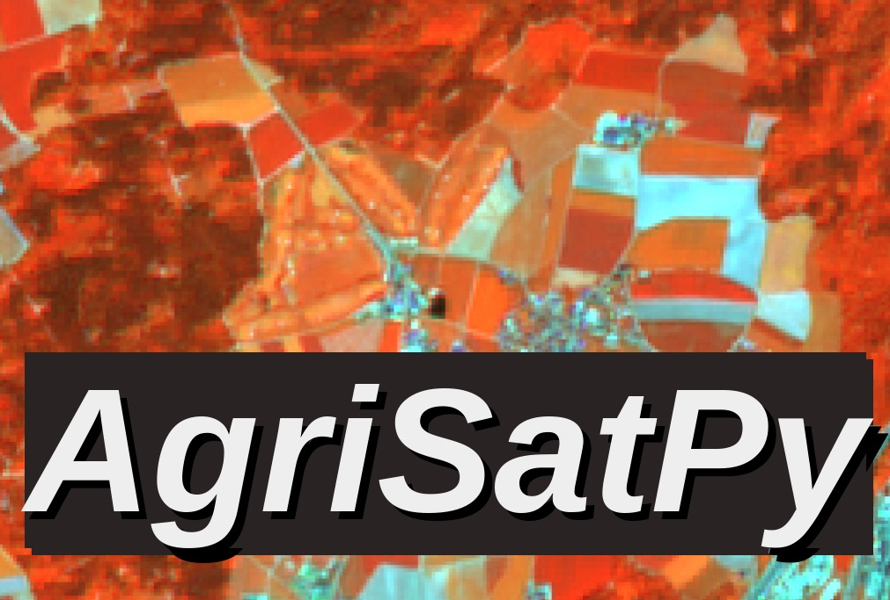

AgriSatPy
=========

*AgriSatPy* is a lightweight `Python` package to **explore**, **organize** and **process** geo-spatial **raster** and epecially (satellite) **remote sensing data** in an easy and intuitive manner.

Developed for **agricultural remote sensing applications** with
**Sentinel-2**, this is still the main thematic focus. However, due to its **modular and object-oriented programming structure**, it allows in principle the **processing of any type of raster data** and can
be **adapted** to **other remote sensing platforms** or **raster data sources** (e.g., Digital Elevation Models, Land Cover Maps, etc.).

We believe that researchers and analysts should **deal as little as possible with file handling and backend engineering**. In addition, the underlying source code should be **open source** and non-proprietary.
Therefore, we have developed *AgriSatPy* in such a way that a large part of these tasks is taken away from the user and provided in the form of self-explanatory attributes and methods on a high semantic level.

.. toctree::
   :maxdepth: 4
   :caption: Contents:
   
   source/agrisatpy.rst
   examples.rst
   contributing.rst

Installation
------------
The easiest way to install AgriSatPy works via `pip`:

``pip install agrisatpy``

This will also install all required dependencies.

Quickstart
----------

See :ref:`examples` to get started with *AgriSatPy*. 

For **developers**: All classes, methods and functions are documented in the :ref:`api-docs`.

Indices and tables
==================

* :ref:`genindex`
* :ref:`modindex`
* :ref:`search`
